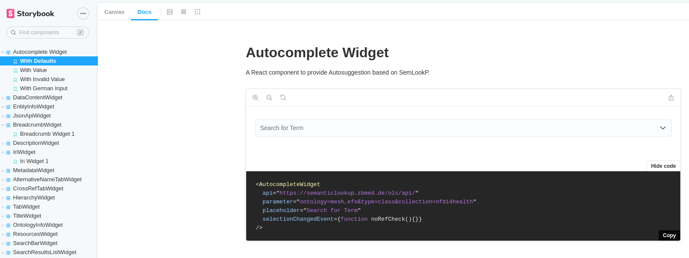

# semlookp-widgets

## About The Project

This project includes a widget component library derived from the semantic lookup service 
[SemLookP](https://semanticlookup.zbmed.de/ols/index). The Terminology Service is a repository for biomedical resources 
that aims to provide a single point of access to the latest ontology and terminology versions. User interface (UI) 
functionalities were extracted and implemented as separate widgets to allow integration into other 3rd party services, 
thus simplifying the development of user interfaces and the visualization of semantic information. 

The widgets are built with React and TypeScript and can be used in React applications. SemLookP and the widgets are 
based on the [Ontology Lookup Service (OLS)](https://www.ebi.ac.uk/ols/index), software developed by EBI.
  

## Using this package

This package is published as source code and compiled as an npm package on [GitHub.com](https://github.com/nfdi4health/semlookp-widgets/). To install the package, you need to authenticate to GitHub.com. Detailed documentation on this topic can be found [here](https://docs.github.com/en/packages/working-with-a-github-packages-registry/working-with-the-npm-registry#authenticating-with-a-personal-access-token).

In short: add the following two lines to your local npm configuraiton `~/.npmrc`. Repleace `TOKEN` with yout personal access token (classic).
```
//npm.pkg.github.com/:_authToken=TOKEN
@nfdi4health:registry=https://npm.pkg.github.com
```

Once npm is configured you can install the library using:
```
npm install @nfdi4health/semlookp-widgets
```

For a list of available versions, see our [release page](https://github.com/nfdi4health/semlookp-widgets/releases) or the [npm repository](https://github.com/nfdi4health/semlookp-widgets/pkgs/npm/semlookp-widgets)

### Peer dependencies
The library depends on some peer dependencies that must be provided. The dependencies are explained below:

- The widgets are based on Elastic UI components. To load the correct appearance of the widgets, wrap them inside the
  `<EuiProvider>` component. Elastic UI needs following peer dependencies as well to work correctly:

```
npm install @elastic/eui @elastic/datemath @emotion/react moment prop-types
```

For help see [ElasticUI Provider](https://elastic.github.io/eui/#/utilities/provider)

- The HierarchyWidget uses react-query to fetch data. To make the widget work properly, you have to wrap the component inside a `QueryClientProvider`.

```
npm install react-query
```

For help see [QueryClient](https://tanstack.com/query/v4/docs/reference/QueryClient?from=reactQueryV3&original=https://react-query-v3.tanstack.com/reference/QueryClient)

### Documentation

As documentation we provide a so-called [Storybook](https://nfdi4health.github.io/semlookp-widgets/)  where you can view, build and test all widgets. When you select a widget, you can click on the 'Docs' tab in the top bar to get more information. In the right corner of the displayed widget, you can then click on "Show code" to see a sample code snippet, as shown below:  




## Development

### Run Storybook

This project uses [Storybook](https://storybook.js.org/) to develop independent React components. To start the development server, install the dependencies with `npm install` and start Storybook with this command `npm run storybook`. The interactive documentation is available via `http://localhost:6006`. For more information, please visit https://storybook.js.org/docs/react/get-started/install/

### Commit Message Formating 

This project uses [Semantic Release](https://semantic-release.gitbook.io/semantic-release/), i.e. the CI/CD pipeline analyzes the commit messages and automatically performs a release depending on the format. Therefore, please format your commit messages according to https://www.conventionalcommits.org/en/v1.0.0/

## Funding

This work was done as part of the NFDI4Health Consortium and is published on behalf of this Consortium (www.nfdi4health.de). 
It is funded by the Deutsche Forschungsgemeinschaft (DFG, German Research Foundation) – project number 442326535.
